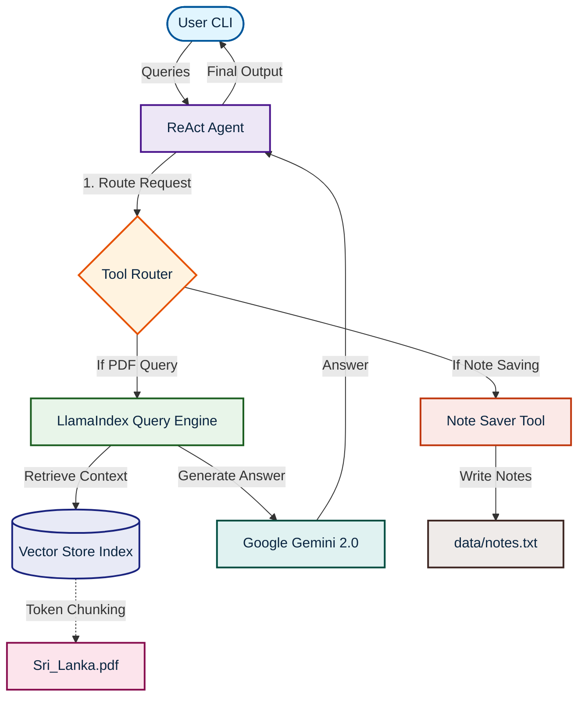

# DocSense AI

DocSense AI is an advanced agentic system powered by LlamaIndex and Google Gemini (gemini-2.0-flash). It processes, indexes, and queries complex PDF documents using Retrieval-Augmented Generation (RAG) while persisting session records dynamically via local tool integration.

## System Architecture

## Core Features
* **Intelligent ReAct Agent**: Autonomously determines whether to consult knowledge bases or execute procedural tools (e.g. saving summaries).
* **API Rate-Limit Optimizer**: Special token-splitting batch loader with custom delay buffers to respect free-tier API quotas.
* **Persistent Vector Indexing**: Caches document vectors locally to guarantee instantaneous search on subsequent runs.
